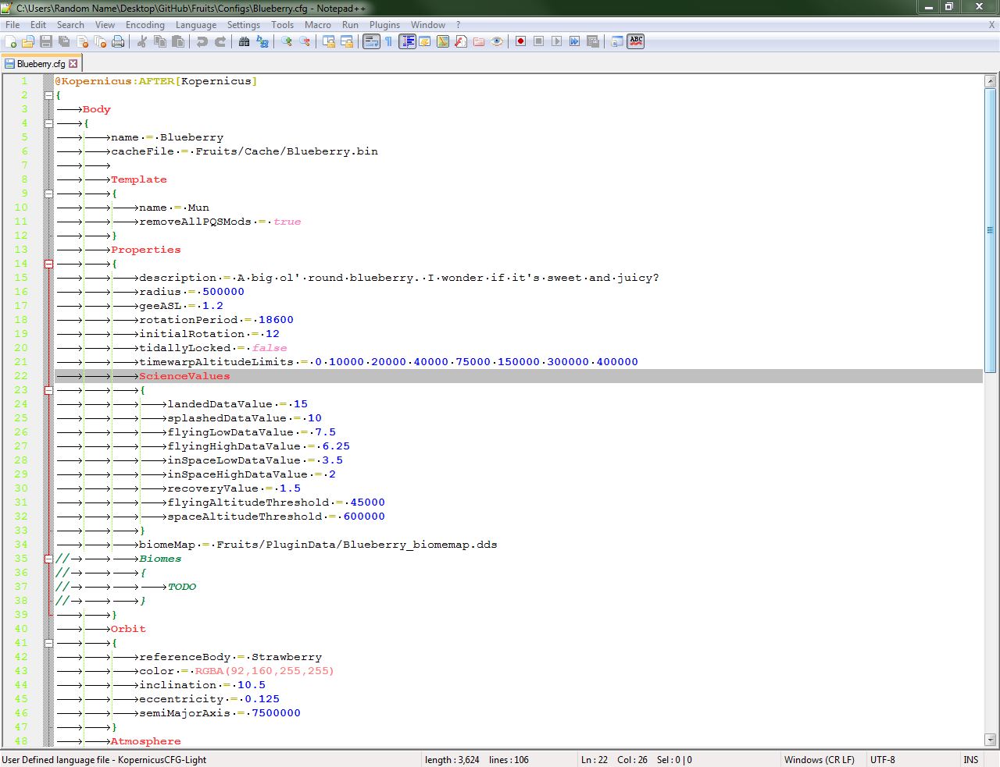
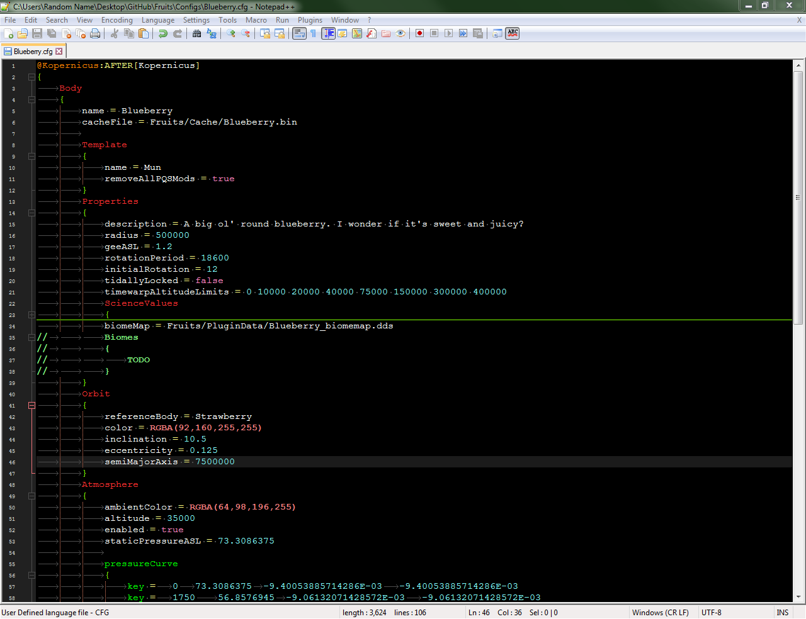

# Kopernicus-Npp-UDL
A Notepad++ User-Defined Language (UDL) for Kopernicus syntax

### Installation
1. Download the corresponding .xml file from this repository. There are light and dark modes.
2. Open Notepad++ and go to Language > Define your own language...
3. Click Import... near the top.
4. Browse to the file you just downloaded and click Open.
5. Restart Notepad++.
6. Go back to Language, but this time, click KopernicusCFG.
7. The current file should change to the KopernicusCFG language. Installation complete!

